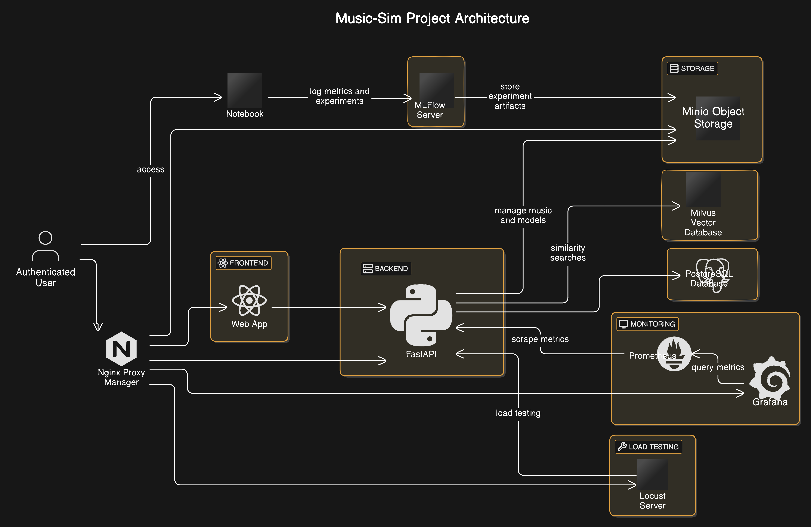

# Monitoring Stack

## Overview
`https://music-sim.fr` est une application full-stack qui permet à ses utilisateurs d'interagir avec une bibliothèque des morceaux de musique d'une toute nouvelle manière; la recherche par similarité !

Ce repo `monitoring-stack` contient tous les outils de monitoring pour le projet music-sim, en particulier l'api megapi
- Prometheus
- Grafana
- MLFlow with a MariaDB backend
- FastAPI-instrumentator
- in the future, it will also use Locust for load testing

**Note:** Ce projet dépend du serveur backend pour le projet qui peut être trouvé ici: [megapi](https://github.com/Hatchi-Kin/megapi).

## Repository Contents
- `.env`: Environment variables file.
- `.gitignore`: Git ignore file.
- `docker-compose.yaml`: Docker Compose configuration file.
- `grafana_data/`: Directory containing Grafana dashboard configurations.
- `locust/`: Directory containing Locust load testing configurations.
- `mlflow/`: Directory containing MLFlow setup and Dockerfiles.
- `prometheus_data/`: Directory containing Prometheus configuration.
- `README.md`: This README file.
- `stress_test.py`: Python script for stress testing the API.


## How to Deploy
1. **Clone the repository:**
    ```sh
    git clone https://github.com/your-repo/monitoring-stack.git
    cd monitoring-stack
    ```

2. **Set up environment variables:**
    Create a `.env` file in the root directory and add the necessary environment variables. Refer to the `.env.example` file for the required variables.

3. **Build and run the Docker containers:**
    ```sh
    docker-compose up --build
    ```

4. **Access the services:**
    - **Grafana:** `http://localhost:3030`
    - **Prometheus:** `http://localhost:9090`
    - **MLFlow:** `http://localhost:5000`
    - **Locust:** `http://localhost:8089`
    
## Architecture




## **Web App:**

`music-sim.fr` est l'interface client. Un User authentifié peut:
 - parcourir une librairie de morceaux de musique comme dans un explorateur de fichier ou bien via des propositions de morceaux similaires
 - gerer une liste de favoris et une playlist
- écouter les morceaux de la playlist. 

Le client utilise des requetes http pour interagir avec le back-end FastAPI. 

*Technos utilisées:* Typescript, React, Next.js, Tailwind, shadcn.


## **Back-end API:** 

`api.music-sim.fr` est l'api qui sert de back-end / server pour la solution globale. L'API gère:
 - l'authentification (FastAPI-login / JWT tokens)
 - les opérations sur la BDD pour stocker les datas concernant les users, la librairies de morceaux (chemins, metadata), les favoris et playlists. (PostgreSQL)
 - les opérations sur la BDD de vecteurs Mlvus hebergée en serverless / free tier par zilliz (Milvus SDK python)
- les api de 2 services AI gratuits (cyanide AI pour recherche par similarité sur la bdd de spotify et limewire pour la génération d'artwork manquants)
 - les opérations sur le stockage d'objets dans un bucket géré par MiniO, pour l'instant simplement la bibli de sons, plus tard les artifact mlflow/models

*Technos utilisées:* FastAPI-login, pydantics, sqlalchemy, pymilvus, Spotipy, Minio, pytest


## **Monitoring:** 

`monitor.music-sim.fr` permet d'acceder aux dashboard grafana pour monitorer le backend et lever des alertes.

Prometheus scrape les metrics depuis le endpoint `/metrics` et les stocke dans une dbb temporelle.

Grafana va pouvoir query Prometheus et ainsi afficher des dashboards dynamiques pour monitorer le comportement / santé de l'api. Et lever des alertes (webhook Discord)

Plus tard, Evidently AI servira de source de donnée supplémentaire pour avoir un dashboard de monitoring spécifique au model.

*Technos utilisées:* FastAPI-instrumentator (Prometheus), grafana ... Evidently AI


## **MLOPS:** 
Plusieurs aspects MLOPS:

 - Github Actions pour le CI/CD d'applications avec tests et deploiment automatisé
 - serveur MLFlow et bucket MiniO pour les experimentations / versionning de models ( UI uniquement accessible sur même réseau que le rpi. Servers uniquement accessible via le client avec les bons credentials).
 - Prometheus / Grafana pour le monitoring du model
 - pourquoi pas ajouter plus tard DVC pour le pipeline d'entrainement / versioning de dataset


## **Self hosted Aspire server:** 

Toutes les briques du projet tournent dans des Docker containers sur un laptop (ubuntu server) et sont accessible depuis internet.

- achat d'un nom de domaine (music-sim.fr) à OVH et création de sous domaines qui redirigent vers ma ISP BOX
- container nginx-proxy-manager pour rediriger le trafic vers les bons ports du serveur en fonction du sous domaine


## 
```bash
CONTAINER ID   IMAGE                             COMMAND                  STATUS                NAMES

5421dc07cac7   monitoring-stack-mlflow           "sh -c 'mlflow serve…"   Up 2 days             monitoring-stack-mlflow-1
ebbc8e0cd1ec   monitoring-stack-locust           "locust -f locust_fi…"   Up 2 days             monitoring-stack-locust-1
c44abfa69ce0   mariadb:latest                    "docker-entrypoint.s…"   Up 2 days             monitoring-stack-mlflowdb-1

67dc21958cca   grafana/grafana                   "/run.sh"                Up 2 days             grafana
ce11b64b9bd0   prom/prometheus                   "/bin/prometheus --c…"   Up 2 days             monitoring-stack-prometheus-1

112d1905a84c   megapi-megapi                     "python app.py --hos…"   Up 3 days             megapi-megapi-1
819e36719363   minio/minio:latest                "/usr/bin/docker-ent…"   Up 5 days             megapi-minio-1
bf63a8778912   postgres:16-alpine                "docker-entrypoint.s…"   Up 5 days             megapi-postgre-1

5f21738fd97b   react-music-sim-web               "docker-entrypoint.s…"   Up 5 days             react-music-sim-web-1
```


