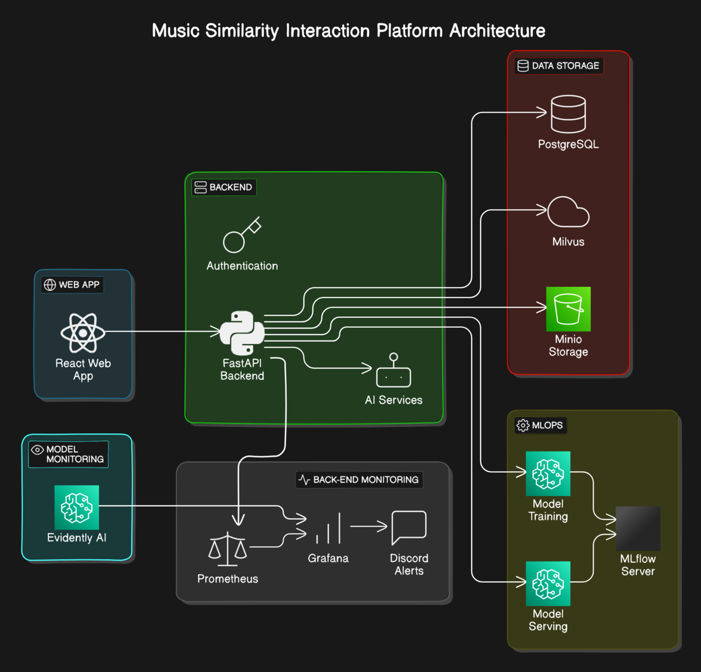

# Overview
`https://music-sim.fr` est une application full-stack qui permet à ses utilisateurs d'interagir avec une bibliothèque des morceaux de musique d'une toute nouvelle manière; la recherche par similarité !


## Architecture




## **Web App:**

`music-sim.fr` est l'interface client. Un User authentifié peut:
 - parcourir une librairie de morceaux de musique comme dans un explorateur de fichier ou bien via des propositions de morceaux similaires
 - gerer une liste de favoris et une playlist
- écouter les morceaux de la playlist. 

Le client utilise des requetes http pour interagir avec le back-end FastAPI. 

*Technos utilisées:* Typescript, React, Next.js, Tailwind, shadcn.


## **Back-end API:** 

`api.music-sim.fr` est l'api qui sert de back-end / server pour la solution globale. L'API gère:
 - l'authentification (FastAPI-login / JWT tokens)
 - les opérations sur la BDD pour stocker les datas concernant les users, la librairies de morceaux (chemins, metadata), les favoris et playlists. (PostgreSQL)
 - les opérations sur la BDD de vecteurs Mlvus hebergée en serverless / free tier par zilliz (Milvus SDK python)
- les api de 2 services AI gratuits (cyanide AI pour recherche par similarité sur la bdd de spotify et limewire pour la génération d'artwork manquants)
 - les opérations sur le stockage d'objets dans un bucket géré par MiniO, pour l'instant simplement la bibli de sons, plus tard les artifact mlflow/models

*Technos utilisées:* FastAPI-login, pydantics, sqlalchemy, pymilvus, Spotipy, Minio, pytest


## **Monitoring:** 

`monitor.music-sim.fr` permet d'acceder aux dashboard grafana pour monitorer le backend et lever des alertes.

Prometheus scrape les metrics depuis le endpoint `/metrics` et les stocke dans une dbb temporelle.

Grafana va pouvoir query Prometheus et ainsi afficher des dashboards dynamiques pour monitorer le comportement / santé de l'api. Et lever des alertes (webhook Discord)

Plus tard, Evidently AI servira de source de donnée supplémentaire pour avoir un dashboard de monitoring spécifique au model.

*Technos utilisées:* FastAPI-instrumentator (Prometheus), grafana ... Evidently AI


## **MLOPS:** 
Plusieurs aspects MLOPS:

 - Github Actions pour le CI/CD d'applications avec tests et deploiment automatisé
 - serveur MLFlow et bucket MiniO pour les experimentations / versionning de models ( UI uniquement accessible sur même réseau que le rpi. Servers uniquement accessible via le client avec les bons credentials).
 - Evidently AI, Prometheus / Grafana pour le monitoring du model
 - pourquoi pas ajouter DVC pour le pipeline d'entrainement / versioning de dataset


## **Raspberry Pi server:** 

Toutes les briques du projet tournent dans des Docker containers sur un raspberry pi 4 et sont accessible depuis internet.

- achat d'un nom de domaine (music-sim.fr) à OVH et création de sous domaines qui redirigent vers ma ISP BOX
- container nginx-proxy-manager pour rediriger le trafic vers les bons ports du raspberry pi en fonction du sous domaine
- portainer pour l'ui mais franchement pas particulièrement utile.


## 
```bash
CONTAINER ID   IMAGE                      COMMAND                   STATUS       NAMES                            PORTS

85853921954e   react-music-sim-web        "docker-entrypoint.s…"    Up 6 days    react-music-sim-web-1            3000:3000  

35bcb145afd2   megapi-megapi              "python app.py --hos…"    Up 6 days    megapi-megapi-1                  8000:8000
1b900386d982   postgres:16-alpine         "docker-entrypoint.s…"    Up 6 days    megapi-postgre-1                 5432:5432
a20865df2c29   minio/minio:latest         "/usr/bin/docker-ent…"    Up 6 days    megapi-minio-1                   9000:9001

ef153803e693   monitoring-stack-mlflow    "mlflow server --hos…"    Up 6 days    monitoring-stack-mlflow-1        5000:5000
96dcf5a7bd35   arm64v8/mariadb            "docker-entrypoint.s…"    Up 6 days    monitoring-stack-mlflowdb-1      3306:3306
b1987bfd06c5   prom/prometheus            "/bin/prometheus --c…"    Up 6 days    monitoring-stack-prometheus-1    9090:9090
cee7fd55ee30   grafana/grafana            "/run.sh"                 Up 6 days    grafana

28c6fb378950   jc21/nginx-proxy-manager   "/init"                   Up 6 days    nginx-proxy-app-1                80-81:80-81
2a0f9113932f   portainer/portainer-ce     "/portainer"              Up 6 days    portainer-portainer-1            9443:9443           
```


